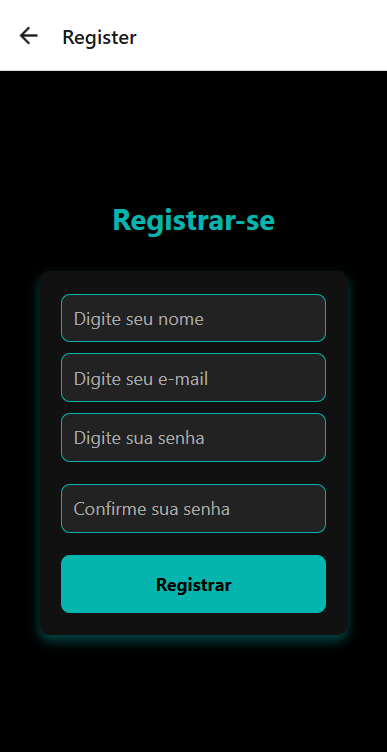
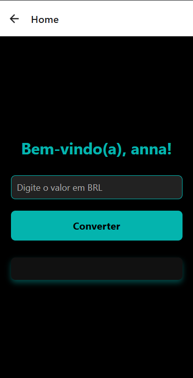
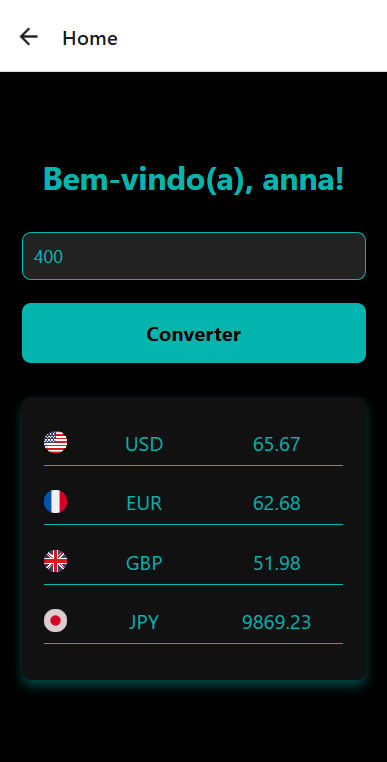

# Conversor de Moedas:

Este é um aplicativo móvel desenvolvido para converter valores em reais (BRL) para outras moedas como USD, EUR, GBP e JPY. Ele utiliza dados de câmbio atualizados pela API para realizar as conversões e exibir os resultados de forma dinâmica e organizada.

## Funcionalidades:

- **Conversão de Moedas**: O usuário pode inserir um valor em reais (BRL) e ver automaticamente a conversão para outras moedas (USD, EUR, GBP e JPY).
- **Exibição dos Resultados**: Os resultados são apresentados em uma tabela, mostrando a bandeira de cada moeda, o nome da moeda e o valor convertido.
- **Interface Simples e Intuitiva**: A interface foi projetada para ser simples e fácil de usar, com uma barra de pesquisa para inserir o valor a ser convertido e um botão para realizar a conversão.

## Capturas de Tela

## Requisitos:

- **Node.js** versão 14 ou superior
- **Expo CLI** para desenvolvimento e execução do app
- **React** versão 18.0 ou superior
- **React Native** versão 0.72 ou superior
- **API de Taxas de Câmbio**: A API utilizada para obter as taxas de câmbio atualizadas.

## Nome dos Programadores:
   - **Ana Júlia Sanros da Silva**
   - **Graziela Dilany Da Silva**

## Curso e Escola:
    - Desenvolvimento de Sistemas
    - Escola Etec Euro Albino de Souza